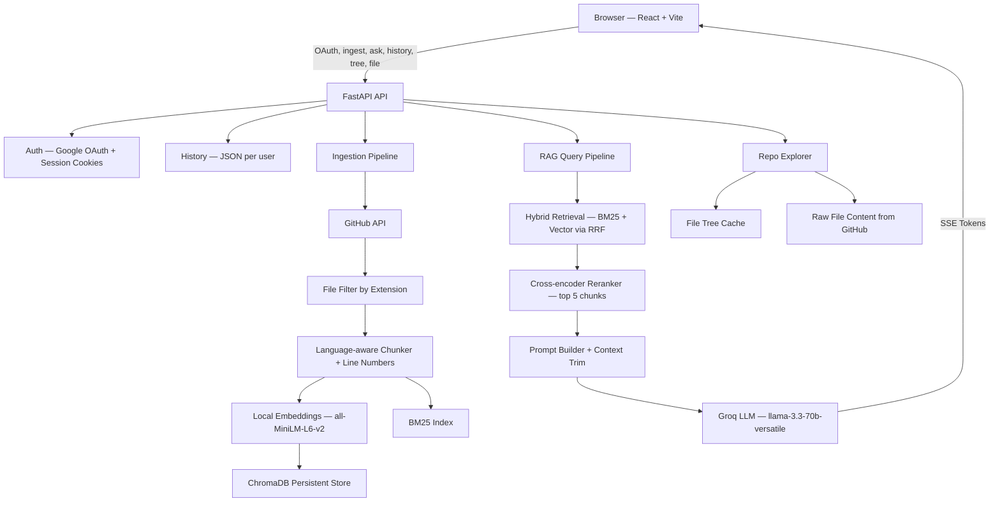

# RepoRAG — Chat with Any GitHub Repository

> Ask questions about any codebase in plain English. RepoRAG ingests a GitHub repo, builds a hybrid search index, and returns answers grounded in the actual source code — streamed token by token.

**Stack:** FastAPI · React · ChromaDB · BM25 · LLaMA-3.3-70B (Groq) · Google OAuth

---

## Live Demo

> 🔗 _Link here after deployment_

---

## What It Does

Point RepoRAG at any GitHub repository URL. It fetches the code, chunks it with language-aware separators, builds a hybrid search index, and lets you ask questions like:

- _"How does authentication work in this project?"_
- _"Where are database connections managed?"_
- _"What does the chunker do with line numbers?"_

Answers are streamed back in real time and cite the source files they came from.

---

## Architecture

```
GitHub Repo URL
      ↓
File Fetcher (PyGithub) + Language-aware Chunker (with line numbers)
      ↓
ChromaDB (vector search)  +  BM25 Index (keyword search)
      ↓
Hybrid Retrieval via Reciprocal Rank Fusion
      ↓
Cross-encoder Reranker (ms-marco-MiniLM-L-6-v2) → top 5 chunks
      ↓
LLaMA-3.3-70B via Groq → SSE streamed answer → React UI
```



---

## Upgrades Over Naive RAG

| Feature | Naive RAG | RepoRAG |
|---|---|---|
| Search | Vector only | Hybrid BM25 + Vector (RRF) |
| Ranking | Cosine similarity | Cross-encoder reranker |
| Evaluation | None | RAGAS metrics |
| Streaming | No | Yes (SSE) |
| Caching | No | In-memory query cache (1 hr TTL) |

---

## RAGAS Evaluation

Evaluated on 10 questions against the [`pranavjhaprof/Red-wine`](https://github.com/pranavjhaprof/Red-wine) repository.

| Metric | Score |
|---|---|
| Faithfulness | 0.38 |
| Context Recall | 0.10 |
| Context Precision | 0.00 |

**Note on low context scores:** RAGAS receives 120-char chunk previews rather than full chunk text due to how the retrieval pipeline formats results. Retrieval quality is observably better in practice — answers correctly cite source files such as `Wine-Quality.ipynb`. This is a known instrumentation gap, not a retrieval failure.

---

## Latency

| Stage | Time |
|---|---|
| Vector + BM25 index load | ~45 ms |
| Hybrid retrieval + rerank + LLM | ~1800 ms |
| **Total (cold)** | **~1850 ms** |

---

## Tech Stack

| Layer | Technologies |
|---|---|
| Backend | FastAPI, LangChain, ChromaDB, rank-bm25, HuggingFace sentence-transformers |
| LLM | LLaMA-3.3-70B via Groq |
| Frontend | React, Vite |
| Auth | Google OAuth 2.0 + session cookies |
| Evaluation | RAGAS |

---

## Project Structure

```
github-assistant/
├── backend/
│   ├── api/
│   │   └── main.py          — FastAPI app, auth, history, repo + RAG endpoints
│   ├── ingestion/
│   │   ├── github_loader.py — GitHub fetcher, file filter, tree builder
│   │   └── chunker.py       — Language-aware chunker with line ranges + dedup
│   ├── rag/
│   │   ├── vector_store.py  — ChromaDB persistence + local embeddings
│   │   └── query_engine.py  — Hybrid retrieval, reranker, prompt, Groq LLM
│   ├── evaluation/          — RAGAS eval harness
│   ├── scripts/             — CLI utilities
│   ├── chroma_db/           — Persistent vector store
│   ├── chat_data/           — Per-user chat history (JSON)
│   └── requirements.txt
└── frontend/
    └── src/
        ├── components/
        │   ├── ChatPanel.jsx    — Chat UI + SSE streaming
        │   ├── IngestPanel.jsx  — Repo ingestion UI
        │   ├── FileTree.jsx     — Repo tree browser
        │   └── CodeViewer.jsx   — Raw file viewer
        ├── hooks/
        │   └── useChat.js       — Chat state, history, SSE handling
        └── App.jsx              — Layout, auth gate, panels
```

---

## API Endpoints

**Auth**
- `GET /auth/login` · `GET /auth/callback` · `GET /auth/user` · `GET /auth/logout`

**Core**
- `GET /health`
- `GET /repos` — list ingested repos
- `POST /ingest` — ingest a GitHub repo by URL
- `POST /ask` — single-shot Q&A
- `POST /ask/stream` — streaming Q&A over SSE

**History**
- `GET /history` · `POST /history` · `DELETE /history` · `DELETE /history/{session_id}`

**Repo Explorer**
- `GET /repo/{repo_name}/tree`
- `GET /repo/{repo_name}/file?path=...`

---

## Local Setup

### Backend

```bash
git clone https://github.com/your-username/github-assistant
cd github-assistant/backend

python -m venv .venv
source .venv/bin/activate        # Windows: .\.venv\Scripts\activate

pip install -r requirements.txt

cp .env.example .env             # fill in your keys (see below)

uvicorn api.main:app --reload --port 8000
```

### Frontend

```bash
cd frontend
npm install
npm run dev
```

---

## Environment Variables

### Backend (`backend/.env`)

| Variable | Description |
|---|---|
| `GROQ_API_KEY` | Groq API key for LLaMA inference |
| `GITHUB_TOKEN` | GitHub personal access token (required for private repos) |
| `GOOGLE_CLIENT_ID` | Google OAuth client ID |
| `GOOGLE_CLIENT_SECRET` | Google OAuth client secret |
| `SECRET_KEY` | Session secret for cookies |
| `OAUTH_REDIRECT_URI` | OAuth callback URL |
| `FRONTEND_URL` | URL to redirect to after login/logout |
| `CHROMA_PERSIST_DIR` | Optional ChromaDB path (default: `./chroma_db`) |
| `GOOGLE_API_KEY` | Gemini API key — only needed to run RAGAS evaluation |

### Frontend (`frontend/.env`)

| Variable | Description |
|---|---|
| `VITE_API_URL` | Backend base URL (used in `App.jsx` for auth) |
| `VITE_API_BASE_URL` | Backend base URL (used in `useChat.js` for API calls) |

---

## Notes

- The repo file tree is cached in memory and rebuilt on server restart.
- Query results are cached for 1 hour to avoid redundant LLM calls on repeated questions.
- Raw file content is fetched live from GitHub for the code viewer — not from the vector store.
- RAGAS evaluation (`evaluation/`) is a standalone harness and is not wired into the live query path.
